<a href="https://www.linkedin.com/in/alokkumar1a8007310/">LinkedIn</a> ·
<a href="https://github.com/Alok200336?tab=repositories">Explore my repositories</a>

### Selected work

- **[Crime Intelligence India](https://github.com/Alok200336/Crime-Rate-Prediction-Model)** — Crime news ingestion and analytics with FastAPI, PostgreSQL and Streamlit.
- **[Generative AI](https://github.com/Alok200336/Generative-AI-Project)** — Experiments with language models and LangChain.

### GitHub activity

