<!-- Refreshed daily by .github/workflows/update-profile-art.yml -->

<h3><code>alok@github ~ $ ./contributions.sh</code></h3>

 
 

<h3><code>alok@github ~ $ whoami</code></h3>

<!-- Keep these filenames in sync with the generated SVG files. -->
<table>
<tr>
<td valign="top"></td>
<td valign="top"></td>
</tr>
</table>

 
 

<h3><code>alok@github ~ $ ./stats.sh</code></h3>

 
 

<h3><code>alok@github ~ $ ./links.sh</code></h3>

<b>Aspiring AI Engineer · Python · Machine Learning · LLMs &amp; RAG</b>

 
 

